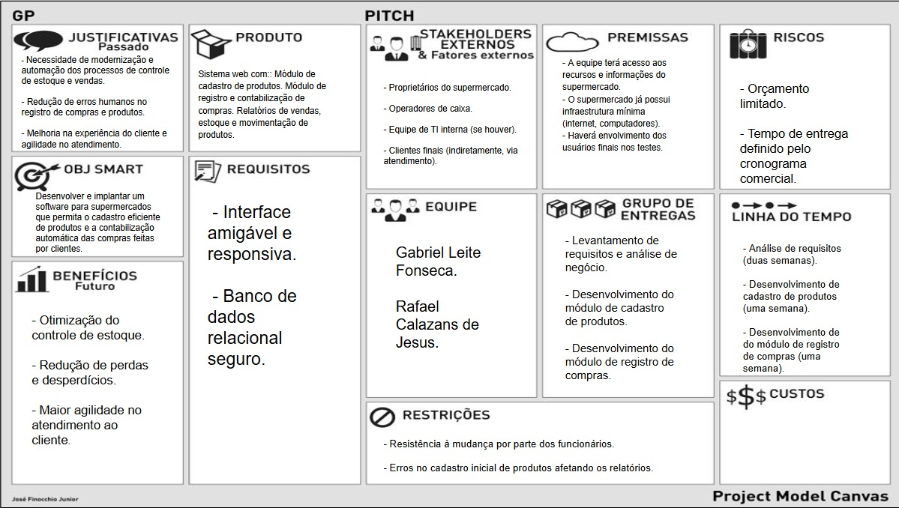
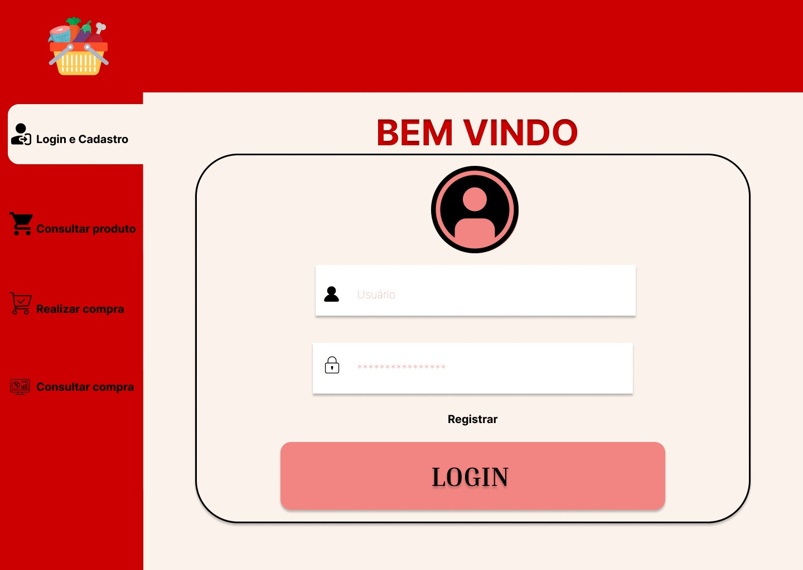
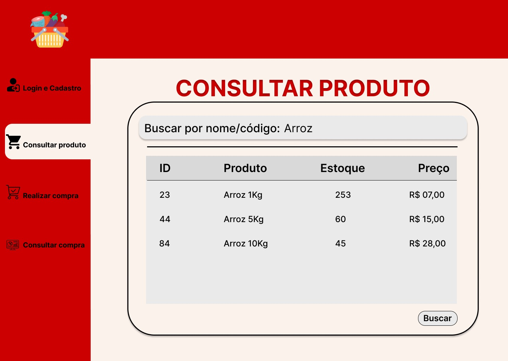
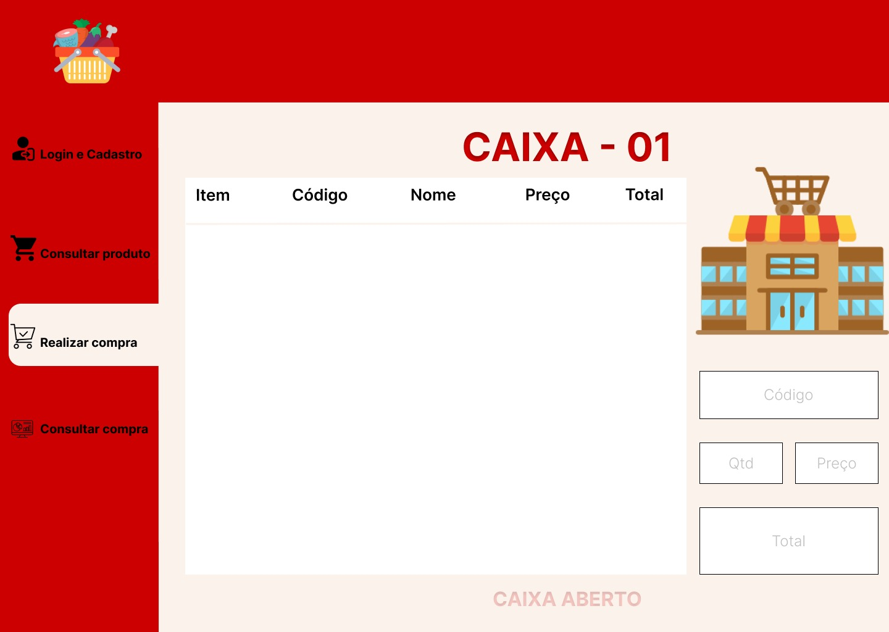
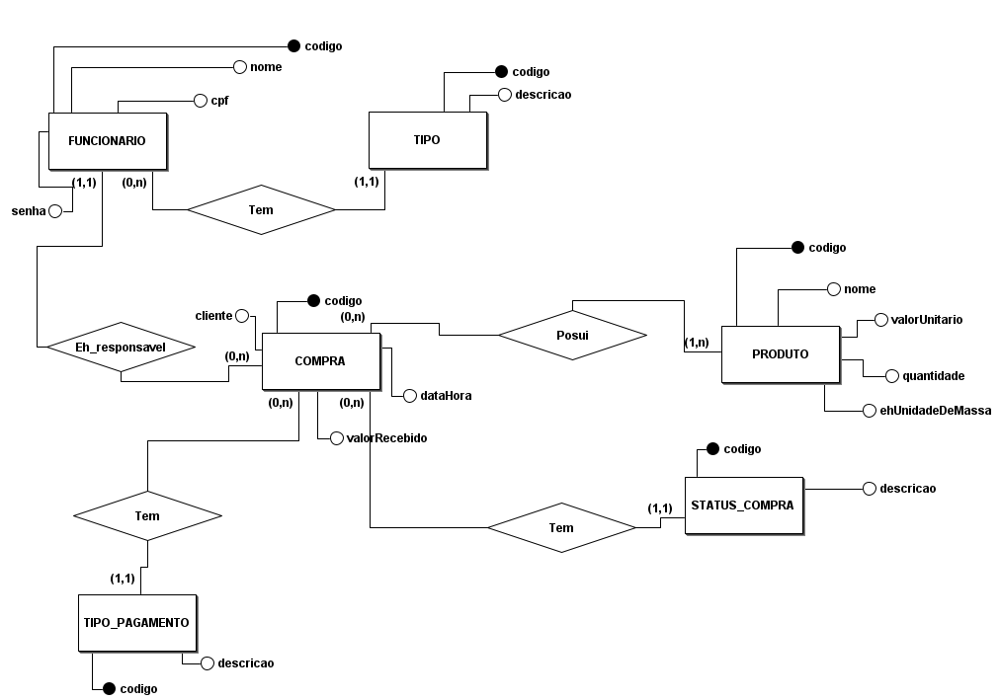
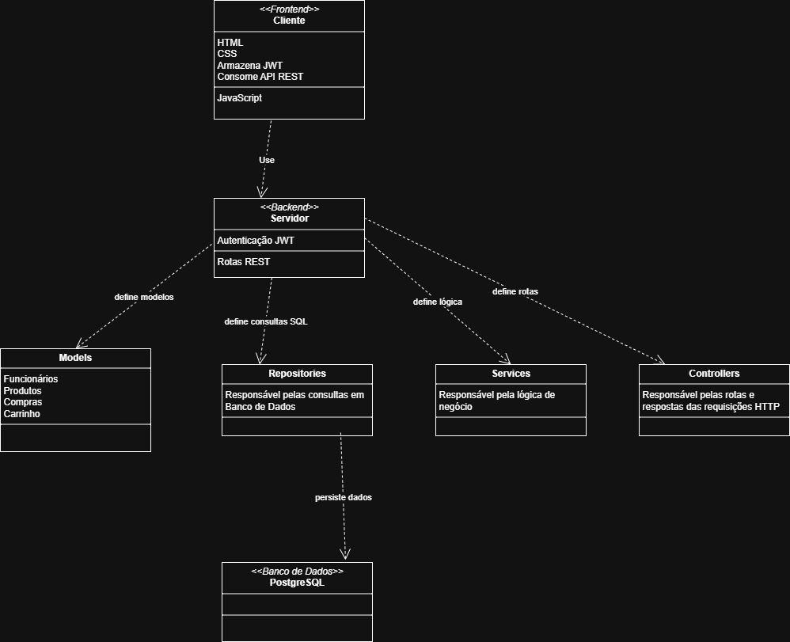

# 📘 Documentação do Projeto - Desenvolvimento Web

---

## 🧾 Visão Geral

 Desenvolver um sistema Web para uso em caixas de supermercado, permitindo o cadastro de produtos e criação de compras.

---

## ✅ Backlog

| ID    | Prioridade | História de Usuário                                                                 |
|-------|------------|--------------------------------------------------------------------------------------|
| HU-1  | 1️⃣         | **No papel de funcionário**, desejo **cadastrar produtos na base de dados do sistema**. |
| HU-2  | 2️⃣         | **No papel de funcionário**, desejo **listar os produtos do mercado**, para saber o que há no estoque. |
| HU-3  | 3️⃣         | **No papel de funcionário**, desejo **ser adicionado ao sistema**, para usá-lo. |
| HU-4  | 4️⃣         | **No papel de funcionário**, desejo **criar uma compra**, para ser levada por um cliente. |
| HU-5  | 5️⃣         | **No papel de funcionário**, desejo **adicionar produtos a uma compra**, de um cliente. |
| HU-6  | 6️⃣         | **No papel de funcionário**, desejo **excluir um item de uma compra**, caso haja um erro de inserção ou desistência da compra de um produto. |
| HU-7  | 7️⃣         | **No papel de gerente**, desejo **listar as compras feitas no mercado**, para saber como andam as vendas. |
| HU-8  | 8️⃣         | **No papel de gerente**, desejo **listar itens de uma compra**, para consultas de histórico. |
| HU-9  | 9️⃣         | **No papel de funcionário**, desejo **fazer login no sistema**, para usá-lo. |
| HU-10 | 🔟         | **No papel de gerente**, desejo **consultar as compras nas quais um fucnionário foi responsável**, para fins de auditoria. |

---

## 🎨 Protótipo de Telas

Cada funcionalidade descrita no backlog possui ao menos uma tela representando sua interface esperada.

### 🖼️ Protótipo do Requisito HU-9

**Figura 1**: Tela de login no sistema — correspondente à história de usuário HU-9.

### 🖼️ Protótipo do Requisito HU-2

**Figura 2**: Tela de consulta de produtos — correspondente à história de usuário HU-2.

### 🖼️ Protótipo do Requisito HU-5

**Figura 3**: Tela de adicionar produtos a uma compra — correspondente à história de usuário HU-5.

### 🖼️ Protótipo do Requisito HU-9 e HU-10

**Figura 4**: Tela de compras feitas — correspondente às histórias de usuário HU-9 e HU-10.

---

## 🏗 Análise e Projeto 

O projeto  do sistema 

### Modelo 

### Esboço da arquitetura geral (cliente-servidor)

### Autorização  e Autenticação 
Somente usuários autorizados podem interagir com os endpoints da api. Para tanto o token JWT é usado para acesso autenticado.

### Tecnologias a serem utilizadas 
SpringBoot, HTML, CSS, PostgreSQL....

---
